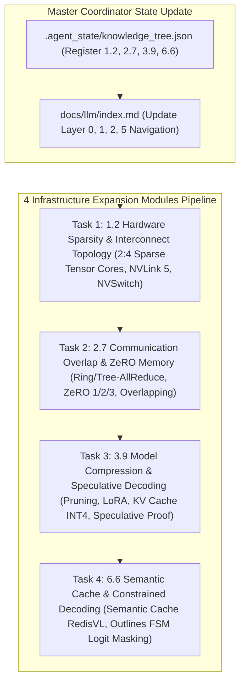

# 4 Key Infrastructure Expansion Modules Implementation Plan

> **For agentic workers:** REQUIRED SUB-SKILL: Use superpowers:subagent-driven-development to implement this plan task-by-task. Steps use checkbox (`- [ ]`) syntax for tracking.

**Goal:** Execute the full 6-Agent Multi-Agent pipeline to create 4 critical infrastructure expansion articles: **`1.2-hardware-sparse-and-interconnect.md`** (Layer 0), **`2.7-distributed-communication-overlap.md`** (Layer 1), **`3.9-model-compression-speculative-decoding.md`** (Layer 2), and **`6.6-semantic-cache-constrained-decoding.md`** (Layer 5), following our strict 7-section depth specification.

**Architecture Diagram:**

**Tech Stack:** VitePress, Vue 3, KaTeX, Markdown, Node.js

---

### Task 1: Module 1.2 - 硬件级计算量与传输削减 (`1.2-hardware-sparse-and-interconnect.md`)
- Nvidia 2:4 Sparse Tensor Cores 结构化稀疏原理与权重压缩格式。
- NVLink 5 (1.8TB/s) / NVSwitch 3 集群拓扑、InfiniBand vs RoCE v2 盲区与 PCIe Gen5 带宽瓶颈。
- Python `SparseTensorCoreSimulator` 模拟代码 + Level 1-6 Onion Q&A + 论文/Repo Anchors.

---

### Task 2: Module 2.7 - 分布式通信与内存优化 (`2.7-distributed-communication-overlap.md`)
- Ring-AllReduce / Tree-AllReduce 通信原语算法与传输量推导：$\text{Data Transferred} = 2 \times \frac{N-1}{N} \times \Psi$.
- ZeRO-1 (Optimizer), ZeRO-2 (Gradient), ZeRO-3 (Parameter) 显存计算公式与 CPU/NVMe Offloading。
- Communication-Computation Overlapping (双缓冲 Double Buffering / Bucket AllReduce)。
- Python `ZeRO3MemoryCalculator` 与分布式通信重叠模拟代码 + Level 1-6 Onion Q&A + DeepSpeed Repo Anchors.

---

### Task 3: Module 3.9 - 架构级计算与显存传输削减 (`3.9-model-compression-speculative-decoding.md`)
- 结构化剪枝 (Magprune) 与 LoRA / QLoRA 梯度推导。
- KV Cache INT8 / INT4 显存量化。
- Speculative Decoding 投机采样无偏拒绝采样 (Unbiased Rejection Sampling) 概率证明与测试。
- Standalone Python `SpeculativeDecodingUnbiasedProof` 代码 + Level 1-6 Onion Q&A + vLLM Repo Anchors.

---

### Task 4: Module 6.6 - 应用级计算削减与路由过滤 (`6.6-semantic-cache-constrained-decoding.md`)
- Semantic Cache (RedisVL) 余弦相似度门控值判定与 30% LLM Token 成本削减。
- Outlines FSM 状态机语法树与 Constrained Decoding Logit Masking 算法。
- Python `SemanticCacheRouter` & `FSMConstrainedDecoder` 代码 + Level 1-6 Onion Q&A + Outlines Repo Anchors.

---

### Task 5: Directory & Navigation Update & Build Verification
- Update `.agent_state/knowledge_tree.json`, `docs/llm/index.md`, and `docs/.vitepress/config.js` sidebar.
- Run `npm run build` in `/Users/soul/AiPro/personal-website` to ensure VitePress compiles cleanly with 0 broken links.
- Commit changes to Git.
