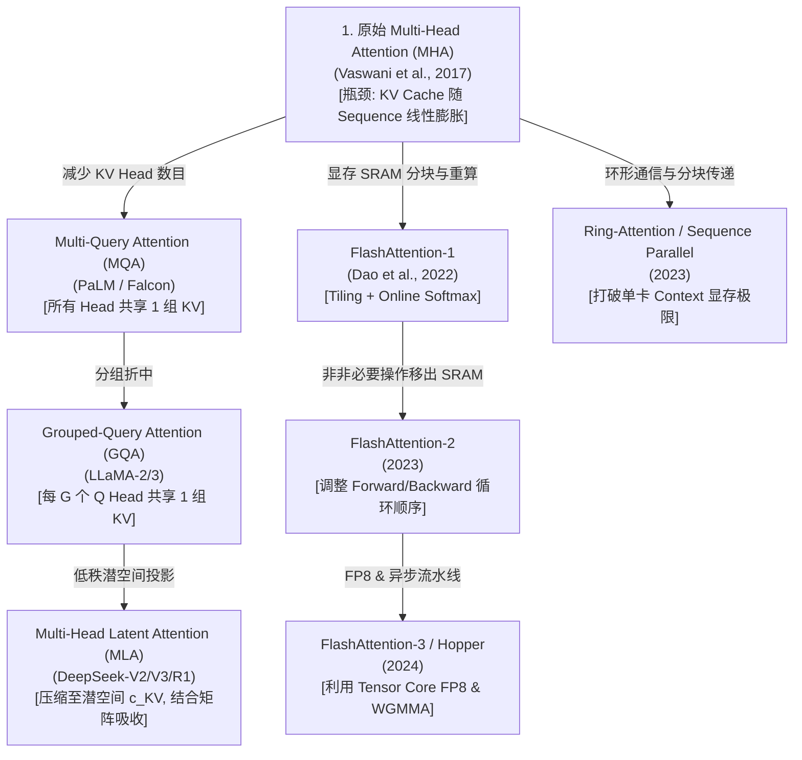

# 结构与开篇优化规范 (Article Structure & Context Spec)

## 1. 核心改进要点

针对您的反馈，我们做出以下两大改进：

1. **移除内部 Agent 声明**：
   - 彻底删除所有类似“*本专栏采用 6-Agent 深度拆解与剥洋葱式面试追问体系构建*”的内部实现说明。
   - 文章保持**纯粹、专业的技术博客/电子书风格**，不暴露任何 AI Agent 运行机制。

2. **新增“导言与技术起源” + “可视化演进分支图”**：
   - 拒绝“无头无尾直接切入 MHA”。文章最开始必须包含 **1.1 问题的由来与背景**：从经典的 RNN/LSTM 串行计算瓶颈、Seq2Seq 无法并行化谈起，引出为什么需要 Transformer 的 Attention。
   - 引入 **可视化技术演进分支树（Mermaid Evolution Tree）**，直观展示注意力机制在**算子加速**（FlashAttention 等）、**显存压缩/头维度**（MQA/GQA/MLA 等）、**长文本外推**（Ring-Attention 等）等不同技术分支上的演进路线，并提供可点击或索引的分支导航。

---

## 2. 改进后的文章开篇模板规范 (`1.1-attention-deep-dive.md`)

```markdown
# 1.1 注意力机制演进全景：从 MHA 到 DeepSeek MLA

## 📖 1. 导言与背景：为什么需要 Self-Attention？

在 2017 年 Transformer 问世之前，自然语言处理（NLP）主要依赖 **RNN (循环神经网络)**、**LSTM** 和 **GRU**。这类架构存在两个致命短板：
1. **无法并行计算**：时刻 $t$ 的隐藏状态 $h_t$ 严格依赖于 $h_{t-1}$，导致 GPU 强大的并行矩阵计算能力无法发挥，训练极慢。
2. **长距离依赖丢失 (Long-range Dependency Loss)**：虽然 LSTM 引入了门控机制，但随着序列变长，梯度消失问题依然严重，无法有效捕获上千 Token 之外的信息。

2017 年 Google 提出 《Attention Is All You Need》，彻底丢弃了循环网络，仅靠 **Self-Attention** 实现了 $O(1)$ 距离的信息直接连接与全序列矩阵并行计算。

---

## 🌳 2. 注意力机制技术演进分支树

自 2017 年 Vanilla Transformer (MHA) 提出以来，注意力机制沿着 **“显存/带宽优化”**、**“IO 硬件加速”** 和 **“长文本外推”** 三条主干路线不断演进：



> **分支路线图解读**：
> - 📌 **主干 A：头结构与 KV 显存优化** (MHA $\rightarrow$ MQA $\rightarrow$ GQA $\rightarrow$ MLA) —— *解决 Decode 阶段显存带宽受限 (Memory-Bound)*。
> - 📌 **主干 B：硬件 IO 与 SRAM 分块加速** (FlashAttention 1/2/3) —— *解决 HBM/SRAM 数据搬运与 $O(N^2)$ 显存开销*。
> - 📌 **主干 C：分布式环形注意力** (Ring-Attention) —— *解决单卡装不下百万 Token KV Cache 的问题*。

---

## 🔬 3. 分支 A 详解：头结构演进与 KV 显存压缩
... （下文展开 MHA / MQA / GQA / MLA 逐级深入的数学推导与代码）
```
