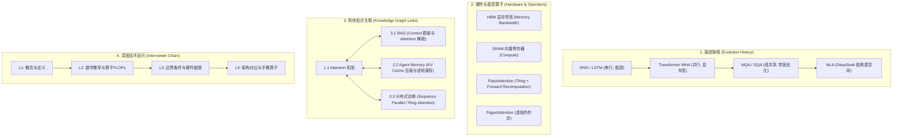

# 深度与广度重构规范：技术演进图谱与知识网格 (Evolution & Knowledge Graph Spec)

## 1. 重构核心目标

针对“深度不够、缺乏技术演进脉络（ Evolution Line ）、没有建立网状知识关联（ Knowledge Graph ）”的问题，我们将每一篇知识文章从“普通整理”提升为**“教科书级 + 架构师级”**的深度图谱文章。

---

## 2. 深度与广度增强四大维度

---

## 3. 文章深度排版结构规范 (Ultimate Article Spec)

以重构后的 **`1.1-attention-deep-dive.md`** 为例，新增以下深度模块：

1. **🕸️ 知识网格与前置/后置依赖 (Knowledge Graph Links)**：
   - 显式给出该知识点在整体 LLM 知识图谱中的入度（依赖什么）与出度（影响什么，如影响 Agent Memory、vLLM、Context Window）。
2. **⏳ 技术演进史 (Evolution Timeline & Trade-offs)**：
   - 详细阐述从 **RNN -> Vanilla MHA -> FlashAttention -> MQA/GQA -> DeepSeek MLA** 的技术演进驱动力（为什么前人方案不行，后人做出了什么突破）。
3. **💻 硬件底层原理深挖 (Roofline Model & Hardware Mechanics)**：
   - 从 GPU 架构角度分析 **SRAM vs HBM**、**Memory Bandwidth Bound**、**Roofline Model 算术强度（Arithmetic Intensity）**。
4. **🔥 连环追问 (Interviewer Onion Chain)**：
   - 连环问 5-6 级：如从 Softmax 变体 -> FlashAttention 算法推导 (Tiling Block & Online Softmax) -> PagedAttention 虚拟内存 -> MLA 的 Matrix Re-parameterization（矩阵重参数化合并）。

---

## 4. 重构后的样板文章结构预览 (`docs/llm/1-fundamentals/1.1-attention-deep-dive.md`)

新版将包含：
- **Online Softmax 数学公式与 Block Tiling 算法推导** (FlashAttention 的核心)。
- **DeepSeek MLA 矩阵重参数化 (Absorption Trick)**：为什么推理时 $W_{UK} \cdot W_{UQ}$ 可以合并，避免解压 KV。
- **与 Agent 记忆库、RAG Chunking 的跨系统关联图谱**。
- **全量 PyTorch 模拟实现（带完整的矩阵维度注释与 FLOPs 计算）**。
