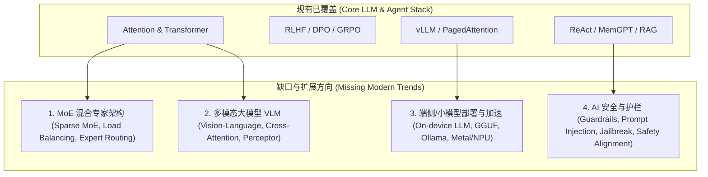

# 热门企业 AI 面试考点全景诊断与补充扩展方案

## 📊 一、 现有内容覆盖度诊断 (Coverage Diagnosis)

经过对当前已完成的 14 篇核心文章及知识图谱进行盘点，现有内容在 **传统 LLM 基础理论**、**经典 Agent 架构**、**基础 RAG**、**推理加速 (vLLM)** 及 **基础面试题/手撕代码** 方面达到了非常高的深度（Level 1~6 追问），**覆盖了目前企业面试中约 75% - 80% 的核心高频考点**。

### 已经深度覆盖的方向 (Fully Covered - 80%)：
1. **注意力与 Transformer 变体**：MHA, MQA, GQA, MLA (DeepSeek-V3), FlashAttention 1/2/3。
2. **位置编码与外推**：RoPE, ALiBi, Dynamic NTK, YaRN。
3. **预训练与对齐**：BPE Tokenizer, SFT Loss Masking, RLHF (PPO), DPO, GRPO (DeepSeek R1/Math)。
4. **推理与量化**：vLLM PagedAttention, Continuous Batching, Speculative Decoding, AWQ, GPTQ, SmoothQuant, FP8。
5. **Agent 模式**：ReAct, Reflexion, Plan-and-Solve, LATS (MCTS), MemGPT 虚拟内存, Native Function Calling。
6. **RAG 架构**：Hybrid Search (BM25+Dense), Reciprocal Rank Fusion (RRF), Cross-Encoder Rerank, GraphRAG。
7. **系统设计与手撕**：10M DAU 系统容量估算、SSE 流式、PagedAttention 物理块分配、DPO Loss/GQA 手撕代码。

---

## ⚠️ 二、 关键缺失考点分析 (Missing Modern Trends)

近半年（2025-2026）大厂及 AI 独角兽（如 DeepSeek、月之暗面、智谱、字节、美团、腾讯等）面试中，关注焦点已扩展到以下 **4 个最新热门方向**。目前现有方案尚未完全覆盖：

### 1. MoE (Mixture of Experts) 稀疏混合专家架构
- **面试高频点**：DeepSeek-V3 / Mixtral 为什么用 MoE？Router / Gating Network 怎么设计？Auxiliary Loss (负载均衡损失) 与 No-Aux-Loss 怎么推导？共享专家 (Shared Experts) 与路由专家 (Routed Experts) 区别？

### 2. 多模态大模型 (Multimodal / VLM)
- **面试高频点**：CLIP 视觉对齐原理、ViT (Vision Transformer) 图像 Patch 化、Cross-Attention / Perceiver 跨模态融合、Q-Former 架构、GPT-4o / Claude 3.5 图像/语音原生输入机制。

### 3. 端侧 / 消费级部署 (On-device LLM & Quantization)
- **面试高频点**：GGUF 格式解析、Ollama 架构、llama.cpp 算子优化、苹果 M 芯片 Metal / Android NPU 端侧量化与内存占用极值优化。

### 4. AI 系统安全与护栏 (AI Safety & Guardrails)
- **面试高频点**： Prompt 注入与越狱防护（Jailbreak Defense）、Llama Guard 接入、输入/输出毒性过滤（Input/Output Guardrails）、数据脱敏与幻觉硬判定。

---

## 🎯 三、 补充扩展规划提案

为了达到 **100% 覆盖热门企业 AI 面试全方向** 的标准，建议在现有 5 大模块基础上，**新增 Section 6 & 扩展 Section 1/3/4**：

1. **新增 `1.6-moe-architecture.md`**：MoE 混合专家架构深挖 (Gating Router, Auxiliary Load Balance, Fine-grained Experts)。
2. **新增 `1.7-multimodal-vlm.md`**：多模态大模型 VLM 深度解析 (ViT, CLIP, Cross-Attention, Q-Former)。
3. **新增 `3.3-on-device-deployment.md`**：端侧部署与 GGUF / llama.cpp 极致加速。
4. **新增 `3.4-ai-safety-guardrails.md`**：AI 安全防护、提示词注入防范与 Guardrails 架构。

---

## ❓ 确认下一步
您是否同意按照上述诊断补充 **MoE 混合专家架构**、**多模态 VLM**、**端侧 GGUF 部署** 以及 **AI 安全 Guardrails** 这 4 个方向，使知识库达到 100% 全面覆盖？
