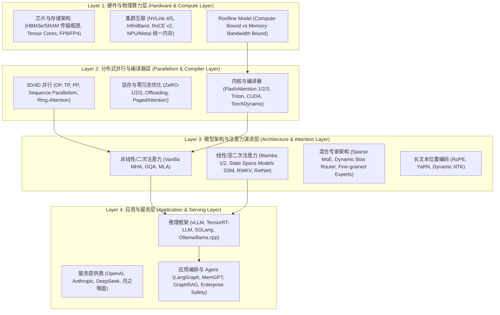

# AI Infra 四层架构与全景演进重构方案 (AI Infra 4-Layer Architectural Spec)

## 🎯 一、 为什么引入 AI Infra 四层架构？

您的直觉非常精准！此前按“基础/Agent/工程/面试”划分虽然清晰，但**缺乏统一的技术视角**，导致难以一览各技术（如线性注意力、各厂商改进、硬件瓶颈）在全局工业界地图中的位置。

通过 **AI Infra 四层架构（Hardware -> Parallel/Compiler -> Architecture -> Serving/Application）**，我们可以把现有的与新增的所有技术（包括线性注意力 Mamba/SSM/RWKV、厂商技术演进、硬件瓶颈与解决办法）完美串联。



---

## 🚀 二、 补全的关键遗漏技术与演进脉络

### 1. 线性注意力与亚二次方架构 (Linear Attention & Sub-quadratic Architectures)
- **解决的瓶颈**：标准 Attention 的 $O(N^2)$ 时间/空间复杂度与 KV Cache 爆炸。
- **演进路线**：
  - **SSM / Mamba 1 & Mamba 2 (State Space Models)**：选择性状态空间 (Selective SSM) 与 硬件感知算法 (Hardware-aware State Expansion)。
  - **RWKV (Receptance Weighted Key Value)**：将 Transformer 转化为可循环衰减的 RNN。
  - **RetNet (Retention Network)**：并行、循环与分块循环三重表示。
  - **Hybrid Architectures (Jamba, Mamba-Transformer)**：结合 Attention 的全局精确召回与 Mamba 的 $O(N)$ 推理吞吐。

### 2. 主要大模型 / 服务提供商 / 推理框架的技术演进对比
- **OpenAI (GPT-4 / GPT-4o)**：从 Dense 走向 MoE，原生多模态 Token 统一编码，极小首包延迟 (TTFT) 调度。
- **DeepSeek (V2 / V3 / R1)**：
  - **架构改进**：MLA (低秩潜空间) 解决 KV Cache，Multi-Head Latent Attention + Dynamic Bias Router No-Aux Loss。
  - **算法/训练改进**：GRPO (弃用 Critic 网络的强化学习) 推动慢思考能力涌现。
- **月之暗面 (Kimi / Moonshot)**：长上下文外推、无损压缩与大容量 Memory 注意力。
- **推理框架改进对比**：
  - **vLLM**：PagedAttention + Continuous Batching。
  - **TensorRT-LLM**：NVIDIA 原生 Tensor Core 算子融合与 FP8/FP4 硬件极值加速。
  - **SGLang**：RadixAttention (前缀树 Prefix Caching 共享 KV Cache) 提升 Agent 复杂工作流性能。

---

## 📖 三、 网站目录全景重构规划 (`docs/llm/`)

将网站目录彻底升格为 **AI Infra 四层架构视图 + 深度主题文章**：

```text
docs/llm/
├── index.md                              # 专栏首页: AI Infra 4层全景地图与知识状态
├── 0-infra-overview/                     # 🌟 【新增】0. AI Infra 四层架构与瓶颈全景图
│   └── 0.1-ai-infra-4layers-overview.md  # 4层架构剖析、各层瓶颈 (Roofline) 与演进路线
├── 1-hardware-compute/                   # 1. 硬件算力与底层存储 (Layer 1)
│   ├── 1.1-gpu-memory-roofline.md        # SRAM vs HBM带宽, Roofline Model, FP8/FP4
│   └── 1.2-on-device-hardware.md         # 苹果 UMA 统一内存, Metal, GGUF/llama.cpp
├── 2-parallel-compiler/                  # 2. 分布式并行与编译器 (Layer 2)
│   ├── 2.1-distributed-3d-parallelism.md # DP, TP, PP, Sequence Parallelism, ZeRO-1/2/3
│   └── 2.2-flashattention-triton.md      # FlashAttention 1/2/3 算法与 Triton 内核
├── 3-architecture-attention/             # 3. 模型架构与注意力演进 (Layer 3)
│   ├── 3.1-attention-evolution.md        # MHA, MQA, GQA, DeepSeek MLA 机制与对比
│   ├── 3.2-linear-attention-mamba.md     # 🌟 【新增】线性注意力: Mamba 1/2, SSM, RWKV, Hybrid
│   ├── 3.3-positional-encoding.md        # RoPE, ALiBi, YaRN, Dynamic NTK
│   ├── 3.4-moe-architecture.md           # Sparse MoE, Dynamic Router, DeepSeek-V3 No-Aux
│   ├── 3.5-multimodal-vlm.md             # ViT, CLIP, Cross-Attention, GPT-4o 原生多模态
│   ├── 3.6-pretraining-sft.md            # BPE Tokenizer, SFT Loss Masking
│   ├── 3.7-rlhf-dpo-grpo.md              # PPO, DPO, GRPO (DeepSeek R1/Math)
│   └── 3.8-quantization-mechanics.md     # AWQ, GPTQ, SmoothQuant
├── 4-serving-application/                # 4. 服务提供商、推理与应用 (Layer 4)
│   ├── 4.1-provider-innovations.md       # 🌟 【新增】厂商与推理框架改进 (vLLM vs SGLang vs TRT-LLM)
│   ├── 4.2-advanced-rag.md               # Hybrid Search, RRF, Cross-Encoder, GraphRAG
│   ├── 4.3-agent-frameworks.md           # ReAct, Reflexion, LATS, MemGPT
│   └── 4.4-ai-safety-guardrails.md       # Prompt Injection, Llama Guard, Dual-Guardrails
└── 5-interview-qa-coding/                # 5. 深度面试与手撕代码 (Interview)
    ├── 5.1-theory-deep-qa.md             # LayerNorm/RMSNorm/AdamW 连环追问
    ├── 5.2-system-design-qa.md           # 10M DAU 系统设计与容量估算
    └── 5.3-coding-handwritten.md         # 5大经典算子与 Agent 引擎手撕代码
```

---

## ❓ 确认下一步

请审查重构方案。如果确认该方案能够**最清晰、最权威、最完整地串联 AI 演进路线与企业面试需求**，我们将启动新架构下新模块（如 AI Infra 四层剖析、线性注意力 Mamba/SSM、服务商与 SGLang/RadixAttention 改进）的补齐与组织！
