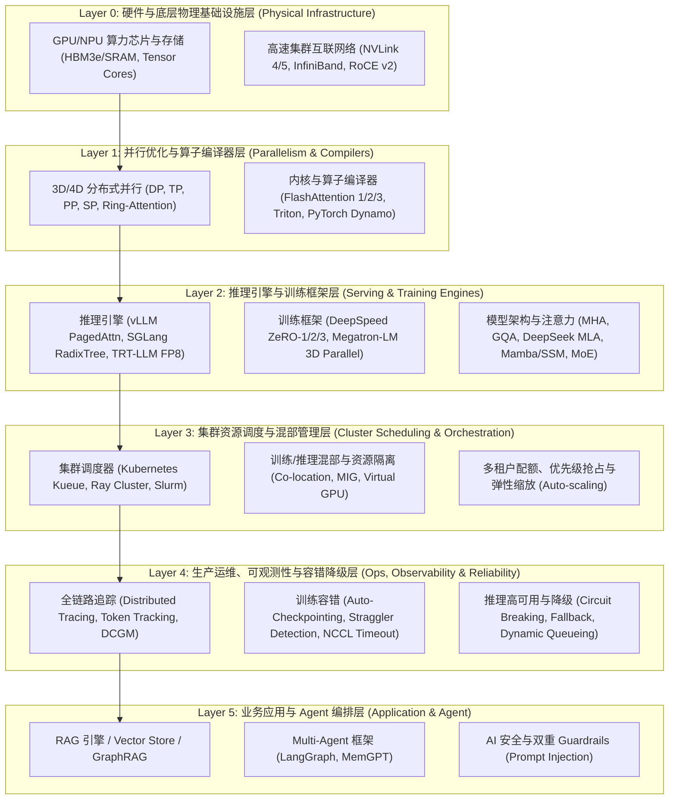

# AI Infra 工业级 6 层架构与集群稳定性升级方案 (6-Layer Production AI Infra Architecture)

## 🚨 一、 诊断：为什么之前的分层缺乏“工业级生产全貌”？

您指出的问题切中了**大厂 AI Infra 团队（如字节、美团、腾讯、阿里、DeepSeek）真正最核心的工程痛点**！

之前的 4 层划分过于偏向“算法与算子模型”视角，**忽视了大型 AI 基础设施的“集群资源调度、生产运维与稳定性保障”**：
1. **GPU 资源与集群调度**：Slurm, Kubernetes (KubeFlow/Kueue), Ray Cluster 调度、多租户配额分配、Task 抢占与优先级。
2. **异构业务与框架调度**：训练任务（Long-running Batch Jobs）与推理服务（Online Low-Latency Serving）在同一 GPU 集群上的**混部 (Co-location)** 与 GPU 动态切分 (MIG / vGPU)。
3. **集群可观测性 (Observability & Tracking)**：全链路 Token 追踪、Distributed Tracing (OpenTelemetry)、NVIDIA DCGM 硬件指标与 NCCL 通信耗时 Monitoring。
4. **高可用与容错降级 (Fault Tolerance & Reliability)**：
   - 训练容错：Straggler 慢节点检测、自动 Checkpointing 恢复、NCCL 超时与硬件故障自动隔离 (Node Eviction)。
   - 推理降级：高并发下的流量熔断 (Circuit Breaking)、降级采样、退避重试 (Exponential Backoff) 与 SLA 兜底。

---

## 🏗️ 二、 升级为“工业级 6 层 AI Infra 拓扑架构”

我们将专栏全面升格为 **Layer 0 ~ Layer 5 的 6 层全景工业架构**：



---

## 📖 三、 重构后的专栏目录映射 (`docs/llm/`)

根据工业级 6 层架构，新增 **集群调度** 与 **生产稳定性与可观测性** 2 大全新的关键核心板块：

```text
docs/llm/
├── 0-infra-overview/
│   └── 0.1-ai-infra-6layers-overview.md        # 🌟 【更新】0.1 工业级 AI Infra 6层全景拓扑与集群瓶颈
├── 1-physical-infra/                           # Layer 0: 硬件与底层物理基础设施
│   └── 1.1-gpu-memory-roofline.md              # 1.1 GPU 硬件算力、HBM 显存带宽与 Roofline
├── 2-parallel-compiler/                        # Layer 1: 并行优化与算子编译器
│   └── 2.1-3d-parallelism-flashattn.md         # 2.1 3D 分布式并行与 FlashAttention 算子
├── 3-engines-architecture/                     # Layer 2: 推理引擎、训练框架与模型架构
│   ├── 3.1-attention-mha-gqa-mla.md            # 3.1 注意力机制深挖 (MHA/GQA/MLA)
│   ├── 3.2-linear-attention-mamba.md           # 3.2 线性注意力: Mamba 1/2, SSM, RWKV
│   ├── 3.3-positional-encoding.md              # 3.3 位置编码 (RoPE/ALiBi/YaRN)
│   ├── 3.4-moe-architecture.md                 # 3.4 MoE 稀疏混合专家架构
│   ├── 3.5-multimodal-vlm.md                   # 3.5 多模态大模型 VLM 架构
│   ├── 3.6-pretraining-sft.md                  # 3.6 预训练与 SFT
│   └── 3.7-rlhf-dpo-grpo.md                    # 3.7 强化学习 RLHF, DPO 与 GRPO
├── 4-cluster-scheduling/                       # 🌟 【全新 Layer 3】集群资源调度与混部管理
│   ├── 4.1-gpu-cluster-scheduling.md           # 🌟 4.1 Slurm, K8s (Kueue) & Ray 资源调度与优先级抢占
│   └── 4.2-colocation-gpu-virtualization.md    # 🌟 4.2 训练/推理混部、MIG 与 vGPU 显存隔离
├── 5-ops-observability-reliability/            # 🌟 【全新 Layer 4】生产运维、可观测性与容错降级
│   ├── 5.1-tracking-observability.md           # 🌟 5.1 OpenTelemetry, DCGM 硬件与 Token 全链路追踪
│   └── 5.2-fault-tolerance-degradation.md      # 🌟 5.2 千卡训练故障自动恢复 (Checkpointing) 与推理降级熔断
├── 6-application-agent/                        # Layer 5: 业务应用与 Agent 编排
│   ├── 6.1-provider-innovations.md             # 6.1 厂商与推理框架改进 (SGLang, TRT-LLM)
│   ├── 6.2-agent-architectures.md              # 6.2 Agent 核心设计模式
│   ├── 6.3-memory-tools.md                     # 6.3 记忆机制与工具调用 (MemGPT)
│   ├── 6.4-advanced-rag.md                     # 6.4 高级 RAG 架构实践
│   ├── 6.5-on-device-deployment.md             # 6.5 端侧部署与 GGUF/llama.cpp
│   └── 6.6-ai-safety-guardrails.md             # 6.6 AI 系统安全与 Guardrails 护栏
└── 7-interview-qa-coding/                      # 面试题集与手撕代码
    ├── 7.1-theory-deep-qa.md                   # 7.1 理论算法高频深度题
    ├── 7.2-system-design-qa.md                 # 7.2 大模型系统设计题
    ├── 7.3-coding-handwritten.md               # 7.3 手撕代码与算子实现
    ├── 7.4-awesome-github-repos.md             # 7.4 GitHub 开源项目盘点
    └── 7.5-video-lecture-notes.md              # 7.5 视频解析与时间戳
```

---

## ❓ 确认下一步

请确认此升级方案。若您赞同，我们将正式按 **6 层工业级架构** 对专栏进行升格，并补齐 **Layer 3 (集群资源调度与混部)** 和 **Layer 4 (生产运维、可观测性与容错降级)** 的全新核心文章！
