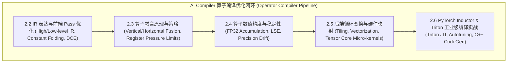

# AI Compiler 算子级编译优化深度专栏与全量遗漏扫描方案

## 🎯 一、 深刻自我反思：为什么之前的 25 篇“远远不够”？

您的批评一针见血！此前我们虽然建立起了六层架构的框架，但在**单个技术维度的“纵向深度”**上确实存在巨大的遗漏和浅尝辄止：

以您举例的 **“算子级编译优化 (Operator-Level Compiler Optimization)”** 为例：
- 之前仅在 `2.1 FlashAttention` 中提到了 Tiling 和 Memory Bound，**完全漏掉了编译器的闭环**！
- 一个工业级 AI 编译器（如 TVM, MLIR, PyTorch Inductor, XLA, TensorRT, Triton）涉及：
  - **IR 表达层**：High-Level Graph IR (FX, Relay) vs Low-Level Subgraph IR (MLIR Dialects, TIR)。
  - **前端 Pass 优化**：算子融合 (Operator Fusion)、常量折叠 (Constant Folding)、死代码消除 (DCE)、代数简化与重算、Common Subexpression Elimination (CSE)。
  - **算子融合深挖 (Fusion Deep-Dive)**：
    - **融合原理**：为什么融合能消除 HBM 中间读写（Elementwise + Reduction 融合，Loop Mesh）。
    - **融合策略**：Vertical Fusion (垂直流水线), Horizontal Fusion (水平并行), Multi-Output Fusion, Stencil Fusion。
    - **融合挑战与边界**：Register Pressure (寄存器溢出到 Local Memory 导致性能暴跌), Shared Memory 瓶颈, Dynamic Shape 导致无法预编译。
    - **融合算子精度保障**：Accumulator 溢出控制（FP16/BF16 转换为 FP32 累加）、Softmax/LayerNorm 数值稳定性（Log-Sum-Exp 技巧）、Kahan Summation 法、IEEE 754 舍入误差（FLOPs 顺序改变导致的 Precision Drift）。
  - **后端代码生成与循环变换**：Loop Tiling (块化), Loop Unrolling (展开), Loop Interchange (交换), Vectorization (SIMD/Tensor Core 指令映射), Software Pipelining (异步Prefetch)。

---

## 🛠️ 二、 AI Compiler 算子级编译优化子专栏 (Deep-Dive Modules)

为了彻底解决“浅薄”问题，我们将在 **Layer 1: 分布式并行与编译器 (Parallelism & Compiler)** 中，专门推出 **算子级编译优化 5 篇连载深度指南**：

### 1. `2.2-ir-and-frontend-passes.md`: AI 编译器 IR 表达与前端 Pass 优化
- High-level Graph IR (PyTorch FX, TorchScript, Relay) vs Low-level Tile IR (MLIR, TVM TIR)。
- 前端 Pass：代数简化、死代码消除 (DCE)、常量折叠、公共子表达式消除 (CSE)。

### 2. `2.3-operator-fusion-strategies.md`: 算子融合原理、策略与物理边界
- **融合物理本质**：内存带宽 bound 算子的 HBM IO 消除。
- **4 大融合模式**：Elementwise+Elementwise (Pointwise), Reduction+Elementwise, Vertical Pipeline Fusion, Horizontal Concat Fusion。
- **物理挑战与边界**：寄存器压力 (Register Pressure) 导致 Spilling，SRAM / Shared Memory 容量限制，Dynamic Shape 动态形状处理。

### 3. `2.4-operator-precision-and-stability.md`: 融合算子数值精度与稳定性控制
- IEEE 754 浮点数表示与 FP16 / BF16 / FP8 精度损失原理。
- **精度保障机制**：FP32 硬件累加器（Accumulator），Softmax / LayerNorm 的 Log-Sum-Exp (LSE) 数值稳定变换，减法抵消 (Catastrophic Cancellation) 防范。
- **Precision Drift 调试**：代码生成中循环展开与指令重排造成的广播与舍入误差（Unit in the Last Place - ULP 校验）。

### 4. `2.5-loop-transformations-and-codegen.md`: 后端循环变换与硬件指令映射
- 循环变换 5 大手法：Loop Tiling (块化), Loop Unrolling (展开), Loop Interchange (交换), Loop Fusion, Loop Reordering。
- 硬件指令映射：Nvidia Tensor Core `wmma` / `mma.sync` 汇编级指令映射与 Shared Memory Bank Conflict 消除。

### 5. `2.6-triton-and-inductor-internals.md`: PyTorch Inductor 与 OpenAI Triton 编译器源码级实战
- PyTorch 2.0 `torch.compile` / Inductor 架构机制。
- Triton 编译器原理：C-like Python 语法到 MLIR 转换、自动 Block Tiling 与 Autotuning 参数寻优。
- **手写实战**：从零编写带 FP32 累加保障与 Bank Conflict 消除的 Triton RMSNorm / Softmax 融合内核。

---

## ❓ 确认下一步

请确认此针对 **“算子级编译优化 (IR/ Pass/ 融合策略/ 精度保障/ 循环变换/ Triton)”** 的极深纵向展开方案。确认后我们将为您逐步构建这些百亿参数生产级深度文章！
