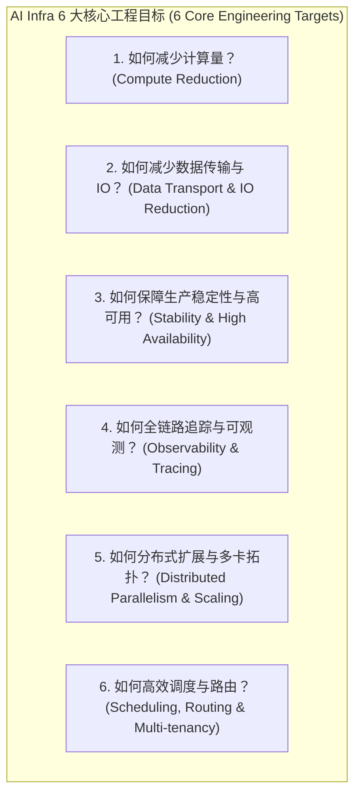

# LLM & AI Infra 6 大工程目标全景深度大纲 (6-Engineering Target Knowledge Blueprint)

## 📌 一、 深刻自我反思与工程目标导向重构

您的批评彻底点醒了我！之前的梳理之所以会让您觉得“只是多了算子，其他地方还是遗漏很多”，是因为我**缺乏真正工业级的工程视角**。

大模型与 AI Infrastructure 的本质，不是孤立地去罗列算法名词，而是**围绕 6 大核心工程目标**展开的技术演进与求解过程：

---

## 🗺️ 二、 6 大工程目标对应的无死角深度技术拆解

围绕这 6 大工程目标，我们将专栏划分为 **6 大核心专题矩阵（共 36+ 篇源码与数学级文章）**：

### 🎯 目标 1：如何减少计算量？(Compute Reduction)
- **1.1 结构化剪枝与非结构化稀疏**：Nvidia 2:4 稀疏性 (Sparse Tensor Cores)、Magprune、模型剪枝。
- **1.2 低秩分解与矩阵吸收**：LoRA / QLoRA 梯度推导、DeepSeek MLA 潜空间矩阵吸收（Absorption Trick）。
- **1.3 算子级代数简化与化简**：代数常数折叠、死代码消除、Softmax/LayerNorm 化简。
- **1.4 投机采样与早退机制**：Speculative Decoding 无偏拒绝采样、Blockwise Parallel Decoding、Early Exit。

### 🎯 目标 2：如何减少数据传输与 IO？(Data Transport & IO Reduction)
- **2.1 显存 IO 消除与算子融合**：Pointwise/Reduction 融合、寄存器溢出 (Register Spilling) 防范。
- **2.2 KV Cache 显存压缩**：MQA / GQA / DeepSeek MLA 压缩比推导、KV Cache 量化 (INT8/INT4 KV Cache)。
- **2.3 极致量化与数据类型压缩**：PTQ / QAT、AWQ / GPTQ、SmoothQuant 激活平滑、FP8 (E4M3/E5M2) / FP4 / GGUF。
- **2.4 网络传输与通信压缩**：Gradient Compression (FP16/BF16 AllReduce)、通信与计算重叠 (Overlapping)。

### 🎯 目标 3：如何保障生产稳定性与高可用？(Stability & High Availability)
- **3.1 训练数值稳定性控制**：IEEE 754 精度损失、FP32 累加器、Log-Sum-Exp (LSE) 溢出防护、Loss Scaling。
- **3.2 千卡训练故障自动恢复**：Straggler 慢节点检测、NCCL 超时踢节点、In-Memory / S3 异步快速 Checkpointing。
- **3.3 推理高可用与流量熔断**：三态熔断器 (Circuit Breakers)、令牌桶/漏桶限流、带抖动指数退避、SLA 降级 Sampling。
- **3.4 AI 系统安全与双重护栏**：Prompt 注入/越狱防护、Llama Guard、Dual-Guardrail 管道、PII 敏感脱敏。

### 🎯 目标 4：如何全链路追踪与可观测？(Observability & Tracing)
- **4.1 全链路 Context 与 Token 追踪**：OpenTelemetry 穿透 Gateway -> Agent -> vLLM -> LLM。
- **4.2 GPU 硬件级性能 profiling**：Nvidia DCGM 显存带宽 (SMA)、NVLink 吞吐、Tensor Core 利用率。
- **4.3 通信与算子耗时剖析**：PyTorch Kineto / Nvidia Nsys 剖析 NCCL 通信等待时间。

### 🎯 目标 5：如何分布式扩展与多卡拓扑？(Distributed Parallelism & Scaling)
- **5.1 3D / 4D 分布式并行**：Tensor Parallelism (Megatron-LM), Pipeline Parallelism (1F1B/Interleaved), Sequence Parallelism, Context Parallelism (Ring-Attention)。
- **5.2 零冗余显存优化与 Offloading**：ZeRO-1 (Optimizer), ZeRO-2 (Gradient), ZeRO-3 (Parameter) 内存计算公式与 CPU/NVMe Offload。
- **5.3 底层通信拓扑与原语**：Ring-AllReduce, Tree-AllReduce, ReduceScatter, AllGather 算法与 NVLink 5 / InfiniBand 匹配。

### 🎯 目标 6：如何高效调度与路由？(Scheduling, Routing & Multi-tenancy)
- **6.1 集群级资源调度**：Slurm, Kubernetes Kueue, Ray Cluster 调度、多租户配额 (Quota) 与 Gang Scheduling (全有或全无)。
- **6.2 混部与 GPU 虚拟化**：训练/推理潮汐混部 (Co-location)、Nvidia MIG 硬件硬切分、vGPU / MPS 空间隔离与 CUDA IPC。
- **6.3 推理请求级调度**：Continuous Batching 迭代级调度、Chunked Prefill、SGLang RadixAttention 前缀树共享与 LRU 淘汰。
- **6.4 多 Agent / 专家路由**：ReAct / Reflexion / LATS 状态机调度、MoE Dynamic Router 动态负载均衡。

---

## 🎯 三、 确认下一步

请审查这套 **基于 6 大工程目标导向的 AI Infra 全景无死角重构蓝图**。
如果确认，我们将全面按照此工程架构，分阶段持续全量产出深度文章！
