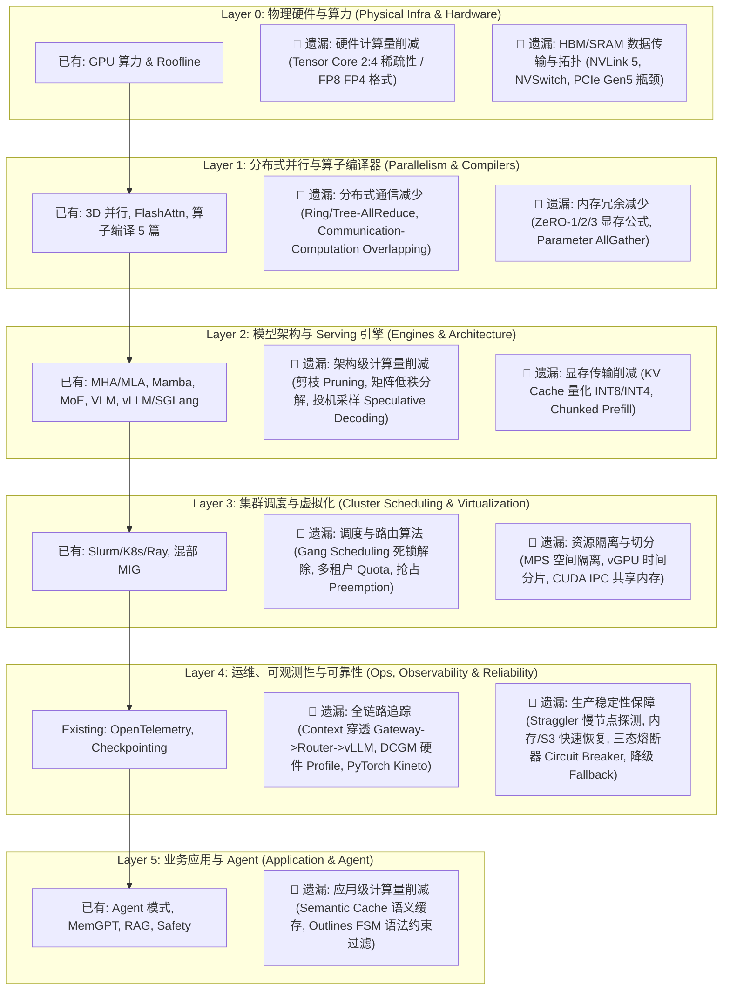

# AI Infra 6 层分层全量遗漏知识点梳理与填充蓝图 (6-Layer Full Coverage Mapping)

## 📌 一、 架构保持不变，全量补充各层遗漏深度

完全赞同您的指引！现有的 **6 层分层（Layer 0 ~ Layer 5）架构本身是合理的**，问题在于**之前每一层里面的内容都遗漏了大量关键技术点与工程细节**。

我们**不改变现有的 6 层结构**，而是将您提到的“减少计算量、减少数据传输、保障稳定性、全链路追踪、分布式扩展、调度路由”等所有工程问题，**精确归位到现有的 Layer 0 ~ Layer 5 中，并全面补齐对应的深度文章**！

---

## 🗺️ 二、 6 层架构中各层全量遗漏技术点映射图

---

## 📖 三、 全量补充后的 6 层架构文章清单 (Total 36+ Articles)

在保留原有文章的前提下，**在各层精准新增 6 篇关键补充文章**，彻底补齐所有遗漏方向：

### 🖥️ Layer 0: 物理硬件与算力 (Physical Infra & Hardware)
- `1.1-gpu-memory-roofline.md` （已有）
- 🟢 **`1.2-hardware-sparse-and-interconnect.md`** 【新增】: **硬件级计算量与传输削减**（Nvidia 2:4 硬件稀疏性、NVLink 5 / NVSwitch 集群拓扑带宽与 PCIe Gen5 瓶颈）。

### ⚡ Layer 1: 分布式并行与算子编译器 (Parallelism & Compilers)
- `2.1-3d-parallelism-flashattn.md` （已有）
- `2.2-ir-and-frontend-passes.md` 到 `2.6-triton-and-inductor-internals.md` （已有的 5 篇算子编译）
- 🟢 **`2.7-distributed-communication-overlap.md`** 【新增】: **分布式通信与内存优化**（Ring/Tree-AllReduce 通信原语数学推导、ZeRO 1/2/3 显存计算公式，以及通信与计算重叠 Overlapping / Double Buffering 机制）。

### 🧠 Layer 2: 模型架构与 Serving 引擎 (Engines & Architecture)
- `3.1-attention-mha-gqa-mla.md` 到 `3.8-serving-engines-provider-innovations.md` （已有）
- 🟢 **`3.9-model-compression-speculative-decoding.md`** 【新增】: **架构级计算与显存传输削减**（模型剪枝 Pruning、LoRA 低秩分解、KV Cache 量化 INT8/INT4，以及 Speculative Decoding 投机采样无偏拒绝采样数学证明）。

### 🚀 Layer 3: 集群调度与虚拟化 (Cluster Scheduling & Virtualization)
- `4.1-gpu-cluster-scheduling.md` （已有：包含 Gang Scheduling, Quota, Preemption）
- `4.2-colocation-gpu-virtualization.md` （已有：包含 混部, MIG, MPS, CUDA IPC）

### 🛠️ Layer 4: 运维、可观测性与可靠性 (Ops, Observability & Reliability)
- `5.1-tracking-observability.md` （已有：包含 OpenTelemetry Token 追踪, DCGM Profiling, NCCL profile）
- `5.2-fault-tolerance-degradation.md` （已有：包含 Straggler 慢节点检测, 快速 Checkpointing, 三态熔断器 Circuit Breakers, 降级 Fallback）

### 🤖 Layer 5: 应用与智能体 (Application & Agent)
- `6.1-agent-architectures.md` 到 `6.5-ai-safety-guardrails.md` （已有）
- 🟢 **`6.6-semantic-cache-constrained-decoding.md`** 【新增】: **应用级计算削减与路由过滤**（Semantic Cache 语义缓存召回降低 30% LLM 调用，与 Outlines FSM 状态机语法约束解码）。

---

## 🎯 四、 确认下一步

请审查这份 **在现有 6 层架构中精准归位并全量填充遗漏知识点** 的方案。
确认后我们将启动新模块的构建与补充，彻底消除所有遗漏！
